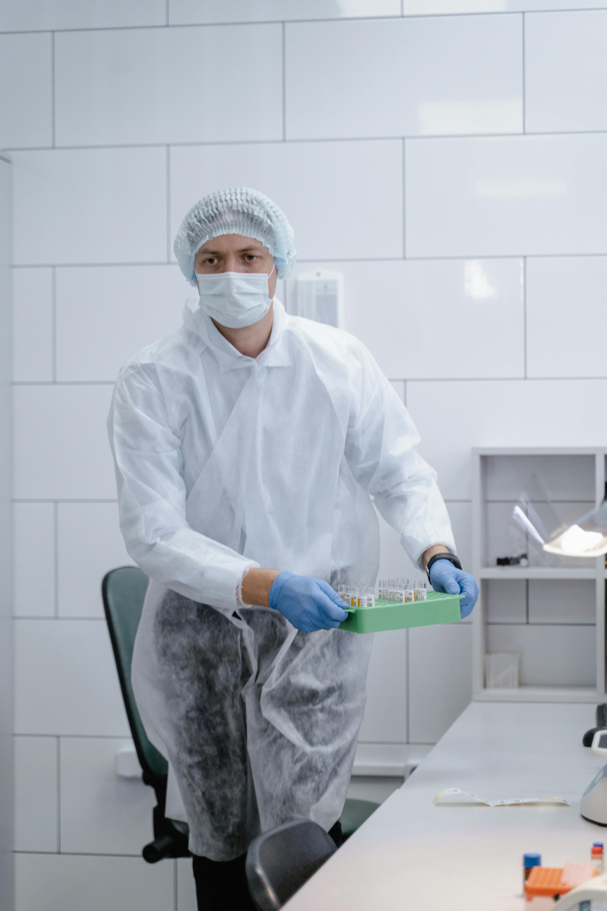
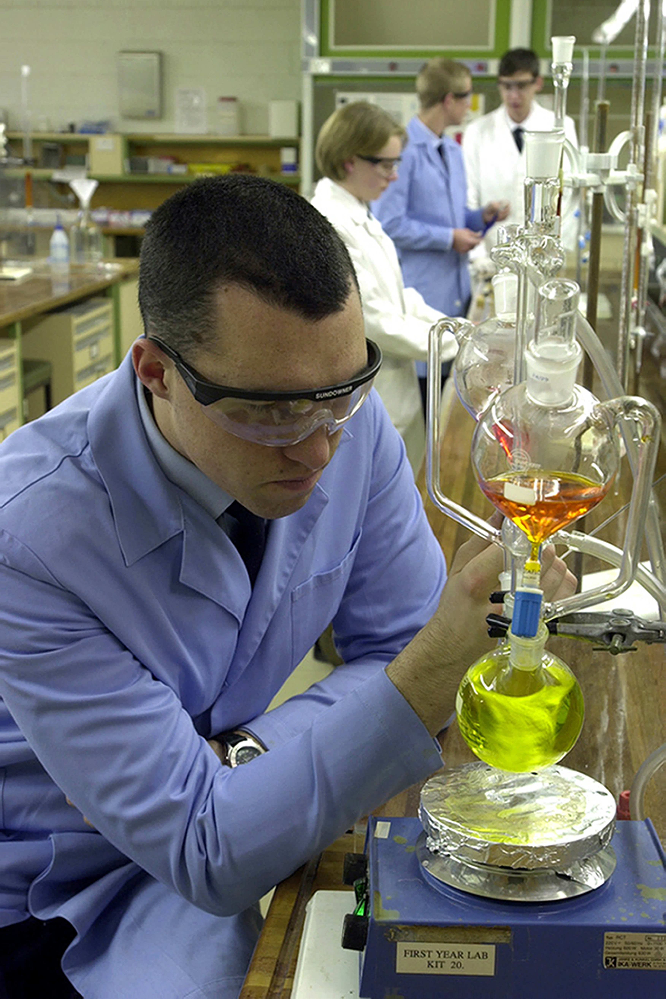

# Laboratory Safety Dataset and Multimodal Evaluation Framework

This repository contains the data samples from our study:  
“Evaluating Multimodal Large Language Models for Real-World Laboratory Safety Reasoning.”

The project introduces the first large-scale dataset of authentic laboratory images annotated for safety compliance, laboratory type, and violation categories. It further benchmarks a range of multimodal large language models (MLLMs) in hazard detection and reasoning fidelity.

---

## Dataset Overview

The dataset comprises 1,527 authentic laboratory images, curated primarily from LAION-400M and filtered via a CLIP-based semantic retrieval pipeline.  
Each image is annotated with structured metadata capturing:

- **`lab_type`**: `Biology`, `Chemistry`, or `Electrical Engineering`
- **`unsafe`**: Binary safety label (0 = safe, 1 = unsafe)
- **`category`**: Violation type (`PPE`, `SOP`, or `WO`)
- **`details`**: Human-readable description of violations
- **`gpt_reason`**: Expert-style textual reasoning generated via LLM prompts

### Dataset Split

| Subset | # Images | Safe | Unsafe | Description |
|:--|--:|--:|--:|:--|
| Train | 1,178 | 605 | 571 | Used for model fine-tuning and prompt optimization |
| Test | 300 | 153 | 147 | Reserved for benchmarking; high-certainty labels only |

Splits were generated using stratified sampling to preserve distribution across:
- Safety status (`safe` / `unsafe`)
- Laboratory domain (`biology`, `chemistry`, `ee`)
- Violation category (`ppe`, `sop`, `wo`)

---

## Annotation Examples

Each entry includes a structured label schema and reasoning text.  
Below are two representative examples:

| Image | Category | Lab Type | Unsafe | Details | GPT Reason |
|:--|:--|:--|:--|:--|:--|
|  | PPE | Biology | 0 | - | “This image shows a biology lab, where the individual is appropriately attired in PPE including a hair cover, mask, gloves, and protective gown, suggesting a sterile work process. The workspace appears organized and clean, and no safety concerns are evident, making this a safe laboratory scene.” 
|  | SOP | Chemistry | 1 | “no gloves, distillation setup on open bench, close prosimity to apparatus, wristwatch worn” | “This is clearly a chemistry laboratory scene, but it is not fully safe: essential hand protection is missing, a heated distillation is running in open lab air, and the worker is positioned unsafely close to the apparatus while wearing a wristwatch. These factors together render the overall setup unsafe despite the presence of lab coats and goggles.”

---

## Evaluation Framework

Each model was prompted with the following evaluation instruction:

> *“You are a laboratory safety expert. Analyze the image carefully and list all visible safety violations. Provide reasoning for each and conclude whether the lab scene is safe or unsafe.”*

### Models Evaluated

| Model | Type | Provider |
|:--|:--|:--|
| GPT-4o | Vision-language foundation model | OpenAI |
| GPT-5-nano | Lightweight multimodal variant | OpenAI |
| GPT-5-mini | Compact multimodal variant | OpenAI |
| GPT-o4-mini | Instruction-tuned image model | OpenAI |
| Qwen2.5-VL | Open-source vision-language model | Alibaba Group |

Each model’s predictions were evaluated along five axes:

1. **Lab-Type Accuracy** — Exact match between predicted and ground-truth lab domain (bio, chem, ee) 
2. **Hazard-Category Exact Match** — 1 if predicted = ground-truth set {PPE,SOP,WO}; 0 otherwise
3. **Category Precision / Recall / F1** — Computed over the three safety-violation types & Partial-credit overlap scoring
4. **Safety Accuracy** — Agreement on overall safe / unsafe decision
5. **Reasoning Quality (0–5)** — GPT-5 rubric-based judgment of factual and conceptual alignment 

Evaluation was performed using **GPT-5 as a reference grader**, following a two-stage pipeline:  
(1) generation → (2) LLM-based structured evaluation.

---

## Results Summary

| Model | Safety Acc. | Lab-Type Acc. | Category Match | Category F1 |
|:--|:--:|:--:|:--:|:--:|
| GPT-4o | 0.663 | 0.850 | 0.644 | 0.740 |
| GPT-5-nano | 0.637 | 0.840 | 0.642 | 0.748 | 
| GPT-5-mini | 0.697  | 0.830  | 0.603  | 0.703 |
| GPT-o4-mini | 0.627 | 0.803 | 0.624 | 0.725 | 
| Qwen2.5-VL | 0.503 | 0.737 | 0.449 | 0.550 | 

